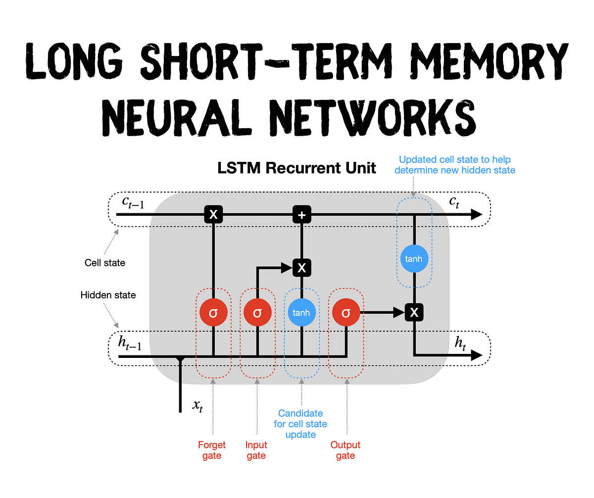

## LSTM

LSTM（Long Short-Term Memory，长短期记忆网络）是RNN（循环神经网络）的一个改进，它通过引入“门”结构来有效地解决传统RNN中的长期依赖问题（即梯度消失）。

- 细胞状态 ($C_t$)：是LSTM的“长期记忆”。在不断循环的过程中进行累积变化。使用了线性加法来构建记忆的核心路径。

- 隐藏状态 ($h_t$)：是LSTM的“短期记忆”。在不断循环的过程中进行更新。是当前时间步的最终输出，也是下一步的输入。

- 当前输入 ($x_t$)：新的输入会不断对长期短期的记忆产生影响。

一句话理解：

$C_t$ 的变化就是通过遗忘门的 $f_t$ 作为参数遗忘对应部分的细胞状态，通过输入门的 $i_t$ 作为参数把新的信息加进来。

$h_t$ 的更新就是从更新后的 $C_t$ 中通过输出门的 $o_t$ 作为参数得到新的 $h_t$ 。

    

    

### 门结构

1. 遗忘门（Forget Gate, $f_t$）

    $$f_t = \sigma(W_f \cdot [h_{t-1}, x_t] + b_f)$$
   
   作用： 决定应从上一时刻的细胞状态 $C_{t-1}$ 中丢弃多少信息。
   
   
   $W_f, b_f$: 遗忘门的权重矩阵和偏置项。
   
   $[h_{t-1}, x_t]$: 上一时刻的隐层状态 $h_{t-1}$ 和当前输入 $x_t$ 的拼接。

   $\sigma$ : Sigmoid激活函数，将输出限制在 $[0, 1]$ 之间。

2. 输入门（Input Gate, $i_t$ 和 $\tilde{C}_t$）
   
   作用： 决定将多少新的信息（即时细胞状态 $\tilde{C}_t$）存入当前的细胞状态 $C_t$。

   a. 决定更新哪些信息（输入门 $i_t$）：

   $$i_t = \sigma(W_i \cdot [h_{t-1}, x_t] + b_i)$$

   $W_i, b_i$: 输入门的权重矩阵和偏置项。

   b. 创建新的候选值（即时细胞状态 $\tilde{C}_t$）：

   $$\tilde{C}_t = \tanh(W_C \cdot [h_{t-1}, x_t] + b_C)$$

   $W_C, b_C$: 候选细胞状态的权重矩阵和偏置项。

   $\tanh$ : 双曲正切激活函数，将输出限制在 $[-1, 1]$ 之间。

3. 更新细胞状态（Cell State Update, $C_t$）
   
   作用： 根据遗忘门和输入门的结果，计算出当前的细胞状态 $C_t$。

   $$C_t = f_t \circ C_{t-1} + i_t \circ \tilde{C}_t$$
   
   $\circ$: Hadamard乘积（即元素级相乘）。
   
   $f_t \circ C_{t-1}$: 上一状态 
   
   $C_{t-1}$ 经过遗忘门“过滤”后保留下来的信息。
   
   $i_t \circ \tilde{C}_t$: 新的候选值 
   
   $\tilde{C}_t$ 经过输入门“选择”后要添加的信息。

   
4. 输出门（Output Gate, $o_t$ 和 $h_t$）
   
   作用： 决定基于当前的细胞状态 $C_t$ 得到多少信息作为当前的隐层状态 $h_t$（或称为“输出”）。
   
   a. 决定输出多少信息（输出门 $o_t$）：
   
   $$o_t = \sigma(W_o \cdot [h_{t-1}, x_t] + b_o)$$
   
   $W_o, b_o$: 输出门的权重矩阵和偏置项。
   
   b. 计算当前隐层状态 $h_t$：

   $$h_t = o_t \circ \tanh(C_t)$$
   
   用 $\tanh$ 对细胞状态 $C_t$ 进行激活（将值缩放到 $[-1, 1]$），再用输出门 $o_t$ 进行“过滤”。
   
   $h_t$ 既作为当前时间步的输出，也作为下一时间步的输入。

### 理解

- 各种参数变量的向量维度：

    $x_t$ 长度：取决于输入编码方式。

    $h_t$ 长度：取决于网络结构设计，即是模型设计者设定的隐藏单元（Hidden Unit）数量，这是一个超参数。

    $f_t, i_t, \tilde{C}_t, o_t, C_t$ 长度： 这些向量的长度与隐藏状态 $h_t$ 的长度相同。原因是方便计算。

    $W$ 权重矩阵的维度：取决于输入的$h_{t-1}$ 和 $x_t$ 拼接后的长度，以及输出的参数权重。

- $f_t$ 和 $i_t$ 是怎么实现其遗忘/更新作用的？又是怎么知道哪里该遗忘/更新？

    $f_t$ 和 $i_t$ 相当于是一个系数，经过$\sigma$后会得到 $0$ 到 $1$ 的系数向量，然后通过元素级相乘的操作，起到对$C_t$等记忆状态的信息进行选择性曝光的作用。

    具体怎么知道哪里该遗忘更新，则是源于权重矩阵 $W_f$ ，而 $W_f$ 是模型在训练过程中通过反向传播和梯度下降学习得到的。

- 为什么需要候选值 $\tilde{C}_t$ ？为什么它也需要一个权重矩阵 $W_f$？

    $\tilde{C}_t$ 的作用是生成新的、候选的长期记忆内容。本质上起到两个作用：
    
    一个是维度转换，把$h_{t-1}$ 和 $x_t$ 的拼接线性投影到 $C_t$ 维度。也包括$\tanh$的处理。

    另一个是特征提取，通过可训练的 $W_C$ ，它会基于当前输入和 $x_t$ 上一时刻的 $h_{t-1}$  既考虑过往也考虑当下，为 $C_t$ 的每个记忆单元生成最合适的候选值，而不是简单的转换。

- 激活函数的本质区别
  
    Sigmoid ($\sigma$) 的本质区别： 它的值域是 $[\mathbf{0, 1}]$。作用： 充当门（Gate）。它用于控制信息的流量（乘以 $0$ 是关闭，乘以 $1$ 是打开），因此必须将结果映射到 $0$ 和 $1$ 之间。
    
    Tanh 的本质区别： 它的值域是 $[\mathbf{-1, 1}]$。作用： 充当内容（Content）。它用于规范化新生成或被传递的信息内容的值，保持数据在零点附近对称，这有助于网络的稳定和训练，同时防止内容值无限增大。

- 在计算当前隐层状态 $h_t$时，为什么又要对 $C_t$ 进行 $\tanh$ 激活？
  
    保证输出 $h_t$ 的范围： $C_t$ 是通过多次线性相加（$f_t \circ C_{t-1} + i_t \circ \tilde{C}_t$）得到的，其值理论上可以很大或很小，没有限制。

    而隐藏状态 $h_t$ 保持在标准化的 $[-1, 1]$ 范围内（这有助于 $h_t$ 作为下一时间步的输入时的稳定性）。

- 能否把 $C_t$ 看成长期记忆 ，$h_t$ 看作短期记忆？

    $C_t$确实可以看作长期记忆： 贯穿网络主线的“传送带”，存储信息，信息只在需要时被选择性地增加或遗忘。它具有长期、稳定的性质。线性加法更新保护梯度，信息可以保留很久。

    但$h_t$ 看作短期记忆不准确：从其计算源头也看得出来，它并不是基于$x$ 得到，而是从更新后的细胞状态 $C_t$中得到。
    
    $h_t$ 应该被理解为 “由长期记忆 $C_t$ 中提炼出的、用于指导下一时间步运算和生成当前预测的上下文摘要”。此外$h_t$ 也是当前时间步的最终输出。

    这意味着无论 $h_t$ 还是 $h_{t-1}$ 都是包含着过往的记忆信息，而非单纯的当下输入 $x$ 的提炼。这也是为什么候选值 $\tilde{C}_t$的计算能够既考虑过往也考虑当下。

- 关于lstm对于梯度消失问题改善的本质，为什么$f_t$的范围也是0到1的情况下，不会像RNN那样很容易地导致梯度消失？

    关键是模型可学习， $W_f$ 是可训练的参数。LSTM 在训练时会学习到：对于那些需要长期保留的记忆，将 $f_t$ 中对应的元素训练到接近 $1$，当 $f_t \approx 1$ 时，连乘并不会导致衰减。这与 $\tanh'$ 导数总是小于等于 $1$ 且平均值远小于 $1$ 的特性完全不同。

    此外lstm不同于RNN，是局部连乘，也就是第一点提到的，可以选择性保留某些通道的信息。

    还有是，标准 RNN 的非线性是在信息流本身上不断累积的，而LSTM 的非线性操作只发生在门控信号 $f_t$ 的计算上，但 $C$ 状态的传播路径本身是线性的（由 $f_t$ 调制）。

<!-- 
信息流经 $C_t$ 主要通过加法和乘法（通过门），这使得梯度在反向传播时更容易流动，从而减轻了梯度消失问题。

 -->

### 总结

- 创新

    一定程度上解决了标准 RNN 的长期依赖问题（Long-Term Dependencies Problem）。

- 不足

    参数量大（四倍于RNN）计算量大

    无法并行运算